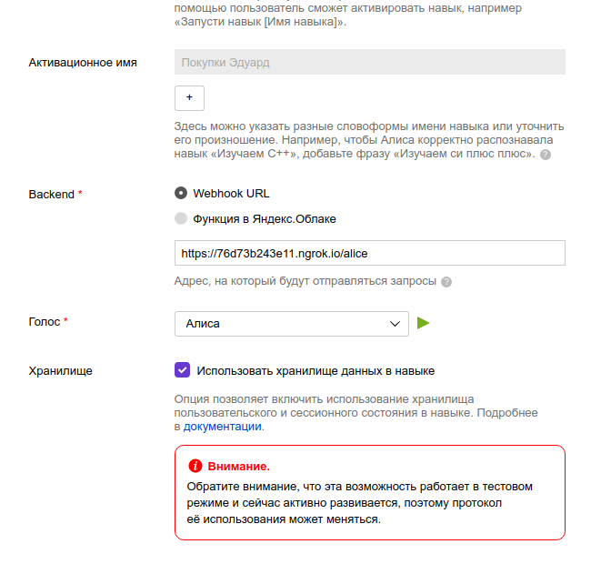
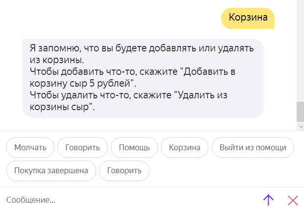
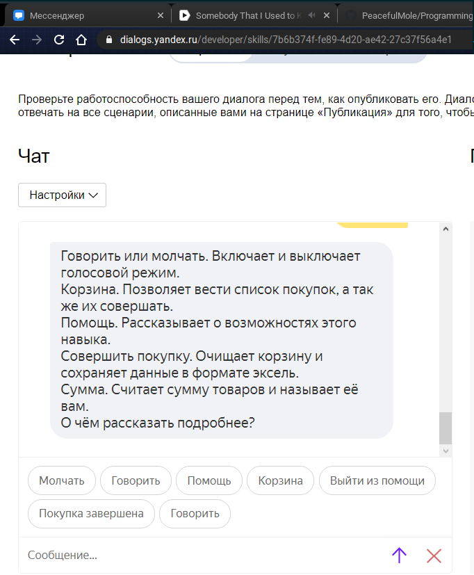

МИНИСТЕРСТВО НАУКИ  И ВЫСШЕГО ОБРАЗОВАНИЯ РОССИЙСКОЙ ФЕДЕРАЦИИ 

Федеральное государственное автономное образовательное учреждение высшего образования 

"КРЫМСКИЙ ФЕДЕРАЛЬНЫЙ УНИВЕРСИТЕТ им. В. И. ВЕРНАДСКОГО" 

ФИЗИКО-ТЕХНИЧЕСКИЙ ИНСТИТУТ 

Кафедра компьютерной инженерии и моделирования

 

<h3 align="center">Отчёт по лабораторной работе № 2  по дисциплине "Программирование"</h3>

  

студента 1 курса группы ПИ-б-о-203 

Сависько Эдуард Сависько 

направления подготовки 09.03.04 "Программная инженерия"

  

<table>

<tr><td>Научный руководитель  старший преподаватель кафедры  компьютерной инженерии и моделирования</td>

<td>(оценка)</td>

<td>Чабанов В.В.</td>

</tr>

</table>

  

Симферополь, 2020

Цель:
Получить представления о структуре post-запроса. Изучить webhooks как метод взаимодействия web-приложений.
<h2>Постановка задачи</h2>
1.  Разработайте и зарегистрируйте навык для Алисы на сервисе ЯндексюДиалоги;
    
2.  В качестве backend-a для навыка реализуйте приложение на языке С++ выполняющее следующие функции:
    
    1.  Составление продуктовой корзины:
        
        -   Добавление продукта в корзину;
        -   Удаление продукта из корзины;
        -   Очистка корзины;
        -   Вывод списка товаров в корзине;
        -   Подсчёт стоимости товаров в корзине.
    2.  Вывод справочной информации по навыку;
        
    3.  Регистрацию webhook-ов сторонних сервисов;
        
    4.  Отправку данных на сторонние сервисы.
     
3.  В качестве стороннего сервиса реализуйте приложение на языке Python выполняющее следующие функции:
    1.  Ожидание данных о покупке;
    2.  Сохранение поступивших данных в excel-документ.
<h2>Выполнение работы</h2>
1)Страница настройки навыка 

2)Функционал корзины

3)Функционал помощи

4)Страница управления вебхуками

4)Excel файл

[Ссылка на kar](./Kar.xlsx)

6)Код серверного приложения 

[Ссылка на код](./MainServer2lab.cpp)

7)Кол клиентского приложения 

[Ссылка на код](./ExcelClient.py)
